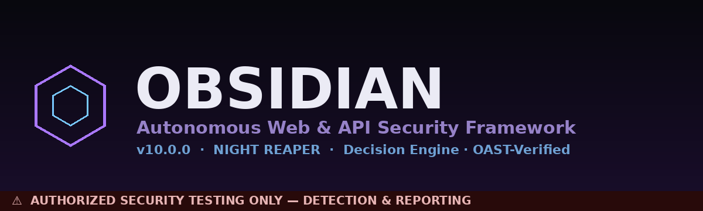

<div align="center">



# ⬢ OBSIDIAN

### Version 10.1.1 — Codename: NIGHT REAPER
### Autonomous Web & API Security Assessment Framework

[](https://python.org)
[](https://owasp.org)
[](https://attack.mitre.org)
[](#)
[](./LICENSE)
[](#modules)
[](#external-tools)

**A comprehensive offensive security scanner covering OWASP Web Top 10 (2021), OWASP API Security Top 10 (2023), MITRE ATT&CK techniques, and CVSS v3.1 severity scoring — built for authorized penetration testing and bug bounty research.**

*Designed & built by [Manish Jaju](https://github.com/MANISH-524) · CEH Certified · Bug Bounty Researcher*

> ⚠️ **FOR AUTHORIZED SECURITY TESTING ONLY.** Always obtain written permission before scanning any target. Unauthorized testing is illegal.

</div>

---

## ⬢ NEW in v10 — Autonomous Decision Engine

OBSIDIAN now ships a **self-directing engine** that crawls, fingerprints, and
*decides* which of its 150+ modules are relevant — instead of running them in a
fixed order. See **[OBSIDIAN_ENGINE.md](./OBSIDIAN_ENGINE.md)** for full docs.

```bash
python3 obsidian.py https://target.tld --profile safe                       # autonomous run
python3 obsidian.py https://target.tld --profile aggressive --i-have-authorization
python3 obsidian.py https://app.tld --scope "*.tld" --oast --plugins plugins --extra-tools
python3 obsidian_core.py                                                     # classic interactive mode
```

| Upgrade | What it does |
|---|---|
| **Decision engine** | State graph + fingerprint gating + expected-value scheduling + finding-driven expansion |
| **OAST verification** | Confirms blind SSRF/RCE/XXE/SQLi via real out-of-band callbacks (kills false positives) |
| **Async core** | Concurrent crawler/prober with rate-limit + per-host politeness rails |
| **Profiles + scope** | `passive`/`safe`/`aggressive` budgets; hard scope allowlist; aggressive needs authorization |
| **Plugins** | Drop-in `plugins/*.py` auto-loaded into the planner |
| **Extra tools** | Optional testssl.sh / retire.js / gitleaks / wapiti / jaeles / dontgo403 integrations |

---

## 📋 Table of Contents

- [Features](#-features)
- [Quick Start](#-quick-start)
- [Installation](#-installation)
- [Usage](#-usage)
- [Module Coverage](#-module-coverage)
- [External Tools](#-external-tools)
- [Zero-FP Architecture](#-zero-fp-architecture)
- [CVSS Scoring](#-cvss-v31-scoring)
- [Output & Reporting](#-output--reporting)
- [Bug Bounty Use Cases](#-bug-bounty-use-cases)
- [Roadmap](#-roadmap)
- [Contributing](#-contributing)
- [Disclaimer](#-legal-disclaimer)

---

## ✨ Features

- **150+ detection modules** covering OWASP Web Top 10, OWASP API Security Top 10 (2023), and MITRE ATT&CK
- **40+ external tool integrations** — Nuclei, Subfinder, HTTPX, Dalfox, SQLMap, Gobuster, FFUF, SSLScan, and more
- **Built-in CVSS v3.1 engine** with automatic severity scoring for every finding
- **Zero-FP architecture** — multi-gate confirmation for every vulnerability (baseline checks, canary tokens, response diffing, encoding verification)
- **Adaptive rate control** — automatically slows down when 429s are detected
- **Smart parameter prioritisation** — tests high-value params (id, uid, pid) first
- **Tech stack fingerprinting** — 100+ signatures for frameworks, CDNs, WAFs, and databases
- **500+ default credential pairs** for login endpoint testing
- **Port-to-CVE database** — maps open ports to known critical CVEs
- **JSON + HTML reports** with full finding detail, evidence, and remediation
- **Auto-installer** — detects and installs missing tools at runtime

---

## ⚡ Quick Start

```bash
# Clone
git clone https://github.com/MANISH-524/OBSIDIAN.git
cd OBSIDIAN

# Install Python dependency
pip install requests

# Run (auto-installs missing tools)
python obsidian_core.py
```

Enter your target URL when prompted, choose scan mode, and let it run.

---

## 🔧 Installation

### Requirements

| Requirement | Version | Notes |
|---|---|---|
| Python | 3.8+ | Core runtime |
| pip / requests | Latest | Auto-installed if missing |
| Go | 1.21+ | Required for Go-based tools (subfinder, nuclei, etc.) |
| git | Any | Required for cloning tool repos |

### Full Setup (recommended)

```bash
# 1. Clone the repo
git clone https://github.com/MANISH-524/OBSIDIAN.git
cd OBSIDIAN

# 2. Install Python requirements
pip install -r requirements.txt

# 3. (Optional) Install Go tools manually for best performance
go install github.com/projectdiscovery/subfinder/v2/cmd/subfinder@latest
go install github.com/projectdiscovery/nuclei/v3/cmd/nuclei@latest
go install github.com/projectdiscovery/httpx/cmd/httpx@latest
go install github.com/hahwul/dalfox/v2@latest
go install github.com/ffuf/ffuf/v2@latest
go install github.com/OJ/gobuster/v3@latest

# 4. Run
python obsidian_core.py
```

The scanner auto-detects which tools are installed and skips what's missing. You don't need every tool — even with just Python + requests it runs 40+ native modules.

### Kali Linux / Parrot OS

Most tools are available via apt. The scanner will auto-install what it can:

```bash
sudo apt-get install -y nikto sslscan wafw00f dnsrecon nmap sqlmap
pip install sslyze arjun wafw00f dirsearch theHarvester
python obsidian_core.py
```

---

## 🚀 Usage

### Interactive Mode

```bash
python obsidian_core.py
```

The interactive menu guides you through:
- Target URL entry (HTTP/HTTPS auto-detection)
- Optional proxy configuration (Burp, OWASP ZAP)
- Output file name and HTML report toggle
- Crawler on/off
- Thread count
- Auto-install tools toggle

### Autonomous Mode (v10 engine)

The self-directing engine crawls, fingerprints, and decides which modules to run within a profile budget:

```bash
python obsidian.py https://target.tld --profile safe
python obsidian.py https://target.tld --profile aggressive --i-have-authorization
python obsidian.py https://app.tld --scope "*.tld" --max-requests 500 --oast -o report.json
```

| Flag | Description |
|---|---|
| `--profile` | `passive` (no payloads) · `safe` (default) · `aggressive` (requires `--i-have-authorization`) |
| `--scope` | extra in-scope patterns: `host`, `*.host`, or `re:REGEX` (target host always in scope) |
| `--max-requests` | hard request budget — the scan stops once it is reached |
| `--oast` | enable the out-of-band verification listener |
| `--plugins DIR` | load drop-in `plugins/*.py` into the planner |
| `-q`, `--quiet` | suppress live progress output |

### Scan Configuration Reference

| Option | Description | Default |
|---|---|---|
| Target URL | Full URL including protocol | required |
| Proxy | `http://127.0.0.1:8080` (Burp/ZAP) | none |
| Output | Report filename | `dd_report_TIMESTAMP` |
| HTML Report | Generate interactive HTML | yes |
| Crawler | Crawl and test discovered URLs | yes |
| Threads | Concurrent scan threads | 5 |
| Auto-install | Install missing tools | yes |

---

## 🛡️ Module Coverage

### OWASP Web Application Security Top 10 (2021)

| ID | Category | Modules |
|---|---|---|
| A01 | Broken Access Control | IDOR/BOLA, 403 bypass, CSRF, open redirect, path traversal, LFI |
| A02 | Cryptographic Failures | SSL/TLS audit, HSTS, weak crypto detection, secret leakage, SRI |
| A03 | Injection | XSS (reflected/stored/blind), SQLi (error/boolean/time), SSTI, SSRF, XXE, NoSQLi, CRLF, LDAP, XPath, SSI, email header, log, HTML/CSS injection |
| A04 | Insecure Design | Mass assignment, business logic, file upload, rate limiting, regex DoS |
| A05 | Security Misconfiguration | Security headers, clickjacking, HTTP methods, host header injection, WAF detection, sensitive files (55+ paths), GraphQL, WebSocket, WSDL/SOAP, CORS, cache poisoning, HTTP smuggling, method override, CT log mining |
| A06 | Vulnerable Components | Outdated JS libraries, CVE mapping via port scan |
| A07 | Auth & Session Failures | Default credentials (500+ pairs), session fixation, JWT analysis, timing attack, account enumeration, MFA bypass, OAuth/OIDC, password policy, rate limiting |
| A08 | Data Integrity Failures | Deserialization detection, SRI checks |
| A09 | Logging & Monitoring Failures | Log injection, missing correlation IDs, error disclosure |
| A10 | SSRF | Cloud metadata (AWS/GCP/Azure/DigitalOcean/Alibaba), localhost service probing |

### OWASP API Security Top 10 (2023)

| ID | Category | Module |
|---|---|---|
| API1 | Broken Object Level Auth | IDOR with numeric ID detection |
| API2 | Broken Authentication | Invalid token acceptance, unauthenticated API access |
| API3 | Broken Object Property Level Auth | Excessive data exposure |
| API4 | Unrestricted Resource Consumption | Pagination limits, wildcard search, deep JSON nesting |
| API5 | Broken Function Level Auth | Admin endpoint access without auth |
| API6 | Unsafe Business Flows | Negative price/quantity attacks |
| API8 | Security Misconfiguration | API doc exposure, debug mode, default routes |
| API9 | Improper Inventory Management | Old API versions, undocumented endpoints |

### Additional Attack Vectors

Prototype pollution · Deserialization · HTTP request smuggling · Type juggling · JWT algorithm confusion · SAML misconfig · S3 bucket enumeration · ReDoS · Broken link hijacking · Certificate transparency log mining · Banner grabbing · SMTP relay · DNS zone transfer · WebDAV · Blind command injection · Race conditions · ZIP slip · Reset token entropy · Formula injection · CSS injection

---

## 🔨 External Tools

The scanner orchestrates 40+ external tools with unified output and auto-deduplication:

### Recon & Discovery
`subfinder` `amass` `sublist3r` `dnsx` `httpx` `naabu` `theHarvester` `dnsrecon` `nmap` `masscan` `katana` `curl`

### Content Discovery
`gobuster` `ffuf` `feroxbuster` `dirsearch` `gau` `waybackurls` `gospider` `hakrawler`

### Vulnerability Scanning
`nuclei` `nikto` `dalfox` `sqlmap` `XSStrike` `commix` `tplmap` `NoSQLMap` `SSRFMap` `Corsy` `jwt_tool` `GraphQLMap`

### Secrets & Code
`trufflehog` `gitleaks` `snallygaster` `arjun` `paramspider` `subjs`

### SSL/TLS
`sslscan` `sslyze` `testssl.sh`

### Enterprise Integrations (Mode 2)
`OWASP ZAP` `OpenVAS` `Nessus` `Acunetix` `Burp Suite` `Qualys` `Semgrep` `Akto`

---

## 🎯 Zero-FP Architecture

Every module in OBSIDIAN uses multiple confirmation gates to eliminate false positives:

**XSS** — unique per-scan per-param canary token → baseline must not contain canary → benign probe (echo-all gate) → raw (unencoded) canary must appear → HTML comment gate → similarity gate

**SQLi** — error must be absent from baseline → boolean: true response ≥90% similar to baseline + false response >50% different + stability confirmed across 2 requests → time-based: median of 3 timings vs 3 baselines + 2/2 confirmation

**SSRF** — response must be larger than baseline → required number of cloud-specific indicators must match → wildcard DNS guard

**IDOR** — only numeric ID params → baseline must be 200 → alternate ID must return 200 + differ >15% → no error indicators → no public-data indicators → JSON field check

**Default Creds** — login form must exist (password field required) → establish known-failure baseline → strong success indicators must appear + failure indicators must be absent + response differs from fail baseline + cookie state change

---

## 📊 CVSS v3.1 Scoring

Every finding is automatically scored using a built-in CVSS v3.1 engine:

```
Score: 0.0 – 3.9  →  Low
Score: 4.0 – 6.9  →  Medium
Score: 7.0 – 8.9  →  High
Score: 9.0 – 10.0 →  Critical
```

Pre-configured vectors for 40+ vulnerability types (XSS, SQLi, SSRF, LFI, RFI, SSTI, file upload, etc.) with automatic AV/AC/PR/UI/S/C/I/A assignment per module.

---

## 📄 Output & Reporting

Classic mode writes reports in any combination of formats via `--format {json,html,csv,sarif,markdown,all}` — JSON, interactive HTML, CSV, SARIF 2.1.0 (for GitHub code-scanning import), and Markdown.

### JSON Report

All findings saved to `dd_report_TIMESTAMP.json` with full detail:

```json
{
  "module": "sqli",
  "title": "Error-Based SQL Injection in 'id' (MySQL)",
  "severity": "Critical",
  "cvss_score": 9.8,
  "cvss_vector": "CVSS:3.1/AV:N/AC:L/PR:N/UI:N/S:U/C:H/I:H/A:N",
  "owasp_id": "A03",
  "owasp_name": "Injection",
  "mitre_id": "T1190",
  "mitre_technique": "Exploit Public-Facing App",
  "url": "https://target.com/page?id=1'",
  "payload": "'",
  "evidence": "You have an error in your SQL syntax...",
  "recommendation": "Use parameterised queries (prepared statements)...",
  "cwe": "CWE-89",
  "confidence": "High",
  "timestamp": "2026-01-01T12:00:00"
}
```

### HTML Report

Interactive HTML report with:
- Risk score dashboard
- Finding count by severity (Critical / High / Medium / Low / Info)
- OWASP Top 10 coverage map
- Sortable finding table with payloads and evidence
- Per-finding remediation guidance
- Tool output summary

---

## 🐛 Bug Bounty Use Cases

OBSIDIAN is built for bug bounty workflows on platforms like HackerOne, Bugcrowd, and Intigriti:

**Recon phase** — subdomain enumeration (subfinder + amass + dnsx), CT log mining, tech fingerprinting, port scanning, wayback URL collection

**Authentication testing** — default credentials, JWT issues (alg=none, no exp, RS256→HS256 confusion), OAuth/OIDC misconfiguration, session fixation, timing-based account enumeration

**Injection testing** — XSS (reflected, stored, blind via Interactsh), SQLi (error, boolean, time-based), SSTI, NoSQLi, LDAP, XPath, SSI, prototype pollution

**API security** — IDOR/BOLA, BFLA, excessive data exposure, broken authentication, resource consumption, old API versions

**Cloud security** — S3/GCS/Azure Blob bucket enumeration, SSRF to cloud metadata (AWS IMDSv1/v2, GCP, Azure)

**Common quick wins** — `.git/HEAD`, `.env`, `phpinfo.php`, exposed admin panels, missing security headers, sensitive file paths (55+ checked)

### Running with Burp Suite

```
Target URL : https://your-target.com
Proxy      : http://127.0.0.1:8080
```

All requests will pass through Burp for inspection, manual replay, and Burp extensions.

---

## 🔮 Roadmap

| Feature | Status |
|---|---|
| HTML report with interactive dashboard | ✅ Done |
| Multi-target batch scanning from file (`-f`/`--file`, `--cidr`) | ✅ Done |
| Slack / Discord webhook notifications | Planned |
| Docker container | Planned |
| CI/CD integration (SARIF output ready; Action pending) | 🔄 In Progress |
| CVE correlation via NVD API | Exploring |
| Passive recon mode (`--profile passive`) | ✅ Done |
| GraphQL schema extraction & testing | Exploring |

---

## 🤝 Contributing

Contributions are welcome — new modules, tool integrations, false-positive reports, and documentation improvements all help.

1. Fork the repo
2. Create a branch: `git checkout -b feat/your-module`
3. Add your module following the `make_finding()` pattern
4. Test against [DVWA](https://github.com/digininja/DVWA) or [Juice Shop](https://github.com/juice-shop/juice-shop)
5. Submit a PR

**Good first contributions:**
- New path/file checks in `module_sensitive_files`
- New tech signature in `TECH_SIGNATURES`
- A new example in `examples/`
- A false-positive fix with a test case

---

## 👤 Author

**Manish Jaju**
- GitHub: [@MANISH-524](https://github.com/MANISH-524)
- LinkedIn: [linkedin.com/in/manish524](https://www.linkedin.com/in/manish524/)
- Bug Bounty: HackerOne · Bugcrowd · Intigriti
- CEH (Certified Ethical Hacker) · Google Cybersecurity · AWS Cloud Security

---

## ⚖️ Legal Disclaimer

OBSIDIAN is designed for **authorized penetration testing and security research only**.

- ✅ Scan systems you own
- ✅ Scan systems you have explicit written permission to test
- ✅ Use on bug bounty targets within the defined scope
- ❌ Do NOT scan systems without authorization
- ❌ Do NOT use against systems you do not own or have no permission to test

Unauthorized scanning may violate the Computer Fraud and Abuse Act (CFAA), the Computer Misuse Act, GDPR, and other local and international laws. The author assumes **no liability** for misuse of this tool.

---

## 📄 License

[MIT License](./LICENSE) — free to use, modify, and share.

---

<div align="center">

*☠️ Where Systems Confess Their Sins ☠️*

**If this helped you — star the repo ⭐ and share it.**

[](https://github.com/MANISH-524/OBSIDIAN/stargazers)

</div>
